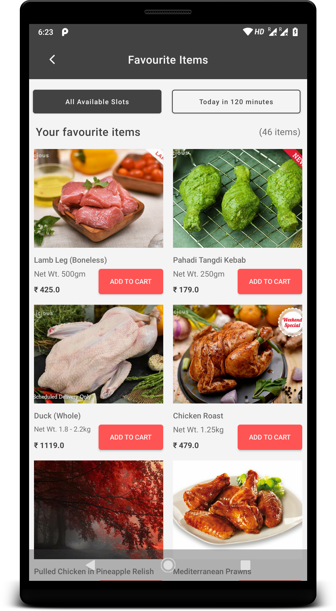

# Favorites-MVVM

### Language : Kotlin

### Architecture

MVVM Architecture with Architecture Components - LiveData & ViewModel
Dagger 2 for dependency injection
OkHttp and Retrofit for networking
Picasso for image loading
Jetpack Navigation Component